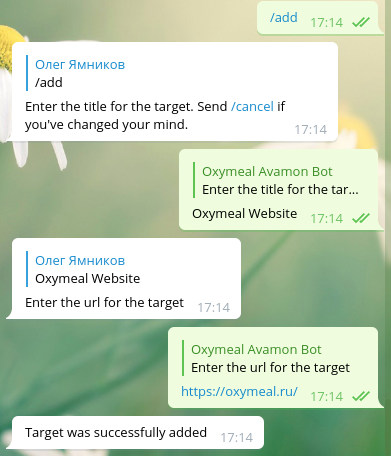
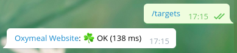
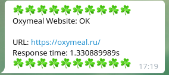
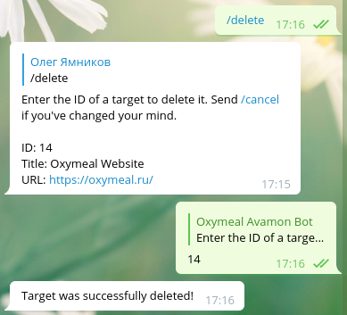

# avamon-bot

Small telegram bot monitoring websites' availability.

## Usage

This bot is not currently hosted for public use, unfortunately. If will have to
host it yourself.

This bot is suitable for adding to groups. All the group members will be able to add, list and delete targets.

### Adding a target



### List all targets



### Notifications




### Deleting a target



## Building and running

### With Docker

You must have Docker installed.

1. Clone the repo.
2. Run `build.sh`, it will build the docker image for you and will tag it `avamon-bot`.
3. Copy the default config from `./frontend/telegrambot/bin/avamon-bot/config.default.toml` and
  edit it however you like. Don't forget to specify the bot token. Set redis host to `redis`.
4. Create `docker-compose.yml` with these contents:
  ```
  version: '3'
  services:
    bot:
      image: avamon-bot
      links:
      - redis
      volumes:
      - ./config.toml:/var/avamon-bot/config.toml:ro
    redis:
      image: redis
  ```
5. Run with `docker-compose up`.

If you want to persist the sqlite3 database, edit the path of the db file in
the config (`database.name` key), then mount it as docker volume.

### With Go compiler.

1. Build and install it: `go get github.com/yamnikov-oleg/avamon-bot/frontend/bin/avamon-bot`
2. Copy and edit the config file at `./frontend/avamon-bot/config.default.toml`.
  Don't forget to specify the bot token. Make sure you have Redis running on localhost.
3. Run it like so: `avamon-bot -config ./path/to/config.toml`
